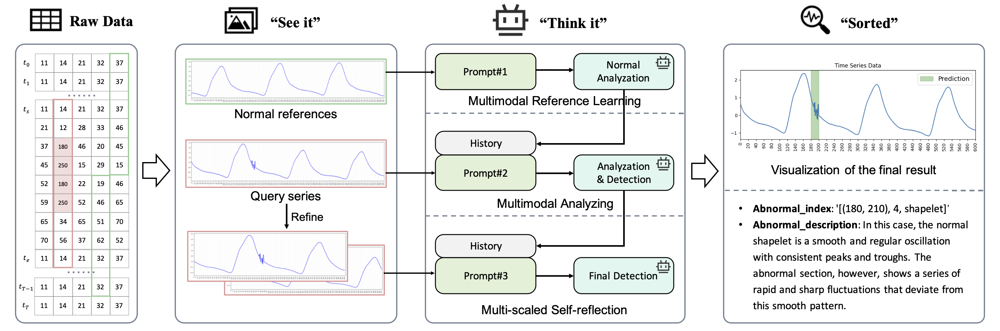

# See it, Think it, Sorted: Large Multimodal Models are Few-shot Time Series Anomaly Analyzers

[](https://opensource.org/licenses/MIT)  [](https://www.python.org)  [](https://arxiv.org/abs/2411.02465) 

This is the official implementation of TAMA in the following paper: [See it, Think it, Sorted: Large Multimodal Models are Few-shot Time Series Anomaly Analyzers](https://arxiv.org/abs/2411.02465). 



### 1. Environment Setup
```shell
pip install -r requirements.txt
```

### 2.Add your API keys 

Before you get started, it is necessary to get API keys of LLMs. In our framework, you should create a .yaml file called `api_keys.yaml` in `BigModel/` directory. The format is shown below:

```yaml
openai:
  api_key: 'Your API Keys'
chatglm:
  api_key: 'Your API Keys'
```


### 3. Prepare for datasets

We use datasets across four domains to evaluate our framework, the detailed information is shown below:

|  Dataset  |     Domain     | Source                                                       |
| :-------: | :------------: | ------------------------------------------------------------ |
|    UCR    |    Industry    | [Current Time Series Anomaly Detection Benchmarks are Flawed and are Creating the Illusion of Progress](https://arxiv.org/abs/2009.13807) |
| NASA-SMAP |    Industry    | [Detecting Spacecraft Anomalies Using LSTMs and Nonparametric Dynamic Thresholding](https://doi.org/10.1145/3219819.3219845) |
| NASA-MSL  |    Industry    | [Detecting Spacecraft Anomalies Using LSTMs and Nonparametric Dynamic Thresholding](https://doi.org/10.1145/3219819.3219845) |
|   NormA   |    Industry    | [Unsupervised and scalable subsequence anomaly detection in large data series](https://doi.org/10.1007/s00778-021-00655-8) |
|    SMD    |  Web service   | [Robust Anomaly Detection for Multivariate Time Series through Stochastic Recurrent Neural Network](https://doi.org/10.1145/3292500.3330672) |
|  Dodgers  | Transportation | [Dodgers Loop Sensor](https://archive.ics.uci.edu/dataset/157/dodgers+loop+sensor) |
|    ECG    |  Health care   | [TSB-UAD: an end-to-end benchmark suite for univariate time-series anomaly detection](https://doi.org/10.14778/3529337.3529354) |
| Synthetic |       -        | We have uploaded this dataset to Google Drive. ( [Link](https://drive.google.com/drive/folders/1KHnnZjNl5Q0DbKRFFWN_J4peTGQJRHQu?usp=share_link) ) |

It is recommended to create a directory `data` before downloading datasets. The file tree should be like:

```shell
./data/
├── Anomaly_Classification -> /nas/datasets/Anomaly_Classification
├── Dodgers
├── ECG
├── NASA-MSL
├── NASA-SMAP
├── NormA
├── SMD
├── UCR
│   ├── 135_labels.npy
│   ├── 135_test.npy
│   └── ...
└── synthetic_datasets
```


### 4. Run

```shell
# convert sequence data into image
python3 make_dataset.py --dataset UCR --mode train --modality image --window_size 600 --stride 200
python3 make_dataset.py --dataset UCR --mode test --modality image --window_size 600 --stride 200
# convert sequence data into text
python3 make_dataset.py --dataset UCR --mode train --modality text --window_size 600 --stride 200
python3 make_dataset.py --dataset UCR --mode test --modality text --window_size 600 --stride 200

# Image-modality
python3 main_cli.py --dataset UCR --normal_reference 3 --LLM 'GPT-4o'
# Text-modality
python3 main_cli_text.py --dataset UCR --normal_reference 1 --LLM 'GPT-4o'
```


### 5. Results Analysis

```shell
# evaluation
python3 evaluation.py
# ablation study
python3 ablation_eval.py
```

The quantitative results across seven datasets:

